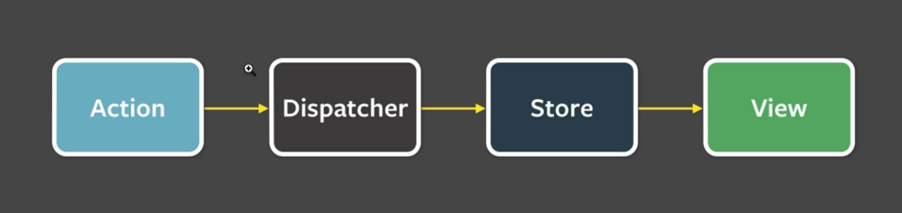

# Redux

### Some History
Before the Flux pattern got adopted at Facebook to solve the unread messages notification problem,
global state of the app used to be managed via `Custom Global Events`, but the problem with these
is that they do inform the rest of the components of a certain change in the state of a part of the app
but they are **NOT** a command, they do not inform to the receivers on what to do with that information.
For that, the `Flux` and later the evolution of it, `Redux`, implemented the `Command And Query Responsability 
Segregation` pattern.  
These are the four elements of the `Flux` architecture:  
  
Notice the uni-directional data flow, which makes things much, much simpler on scale.  

### Why
Redux creates applications that are scalable, predictable in the way they will scale and are easy to reason about if we follow the conventions. Plus, it guarantees uni-directional data flow.

### The most common Redux-like solution for Angular is NgRx
Redux is specially useful for apps that display the same information in many ways,
if we do not centralize the way this information is manages, we have to develop strategies to
manage it in many places, which makes the application exponentially more complex, so is it
a matter of creating applications that scale on complexity. In `NgRx` the concept of `dispatcher`
and `store` have been added together in one single service.

### When to use it
A good guideline that might help answer the question, "Do I need NgRx Store?" is the SHARI principle:

* **Shared**: state that is accessed by many components and services.
* **Hydrated**: state that is persisted and rehydrated from external storage.
* **Available**: state that needs to be available when re-entering routes.
* **Retrieved**: state that must be retrieved with a side-effect.
* **Impacted**: state that is impacted by actions from other sources.

### Redux Devtools
You can:
* Timetravel across the application actions
* Record and reproduce a series of actions and state changes (could be done in production with the appropriate infrastructure)
* Dispatch your own actions with the Action Dispatcher
* See a reproduction of our store state in the `indexDB` database through the package `ngrx/db`

### Implementations
#### Akita
* Build on top of `RxJS`
* Focus on simplicity
* Object-Oriented focus

##### Building blocks
* Model: The general representation of the data model which the store is going to manage.
* Store: a warehouse, where the data model is going to be stored. You can execute all the `DML (Data Manipulation Language)` with the help of Akita built-in store’s methods like `add()`, `update()`, `delete()`, `setActive()`, `setError()`, etc.
* Query: You can run all the DDL (Data Definition Language) with the help of Akita built-in query’s methods like `select()`, `selectAll()`, `selectEntity()`, `selectCount()`, `selectActive()`, etc.

##### Two types of store